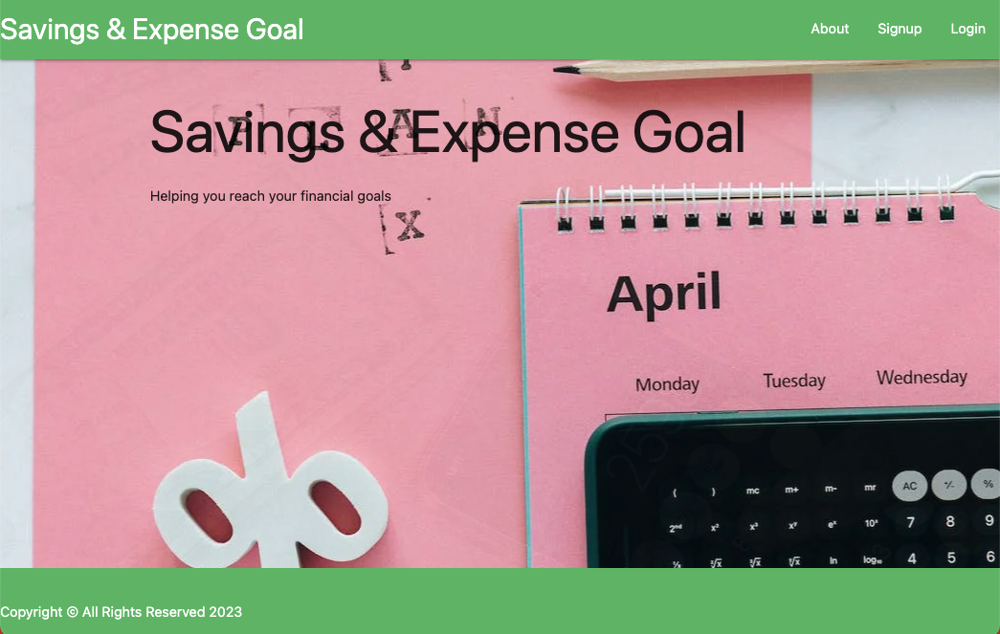
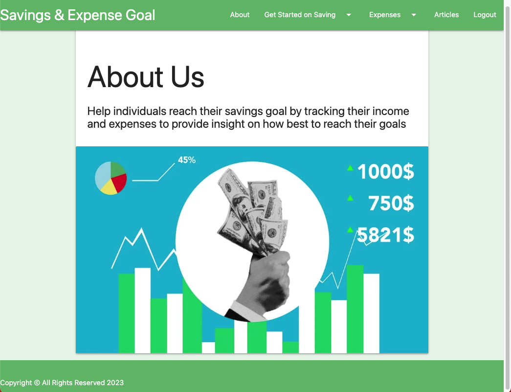
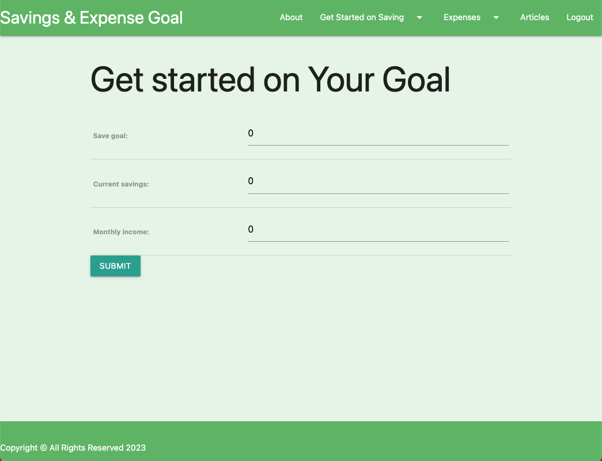
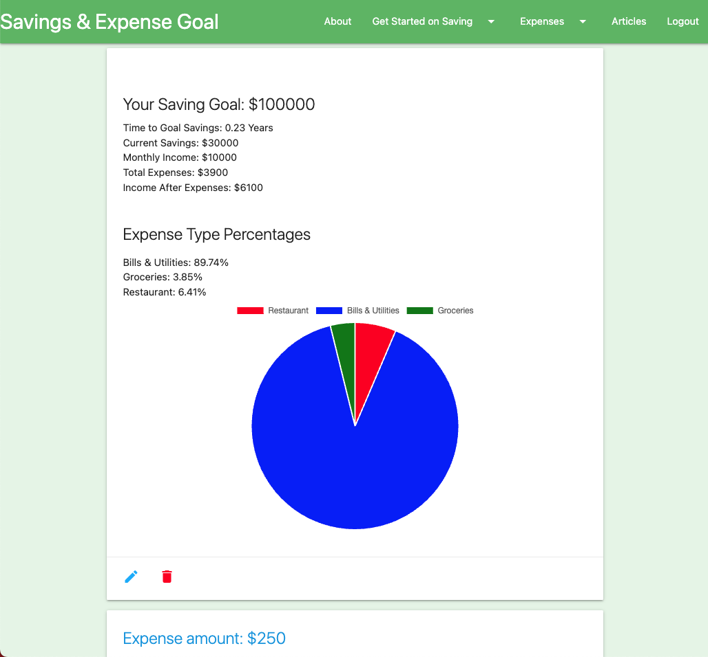

# Savings-Goal

### A web application that allow users to reach a savings goal by tracking their spending and savings habits. Provide insight into where users are spending the most to help them be aware of where they can save. Provide users with educational material on how to save.

# Technologies Used

1. Django
2. Python
3. Materialize CSS
4. jQuery
5. chartjs
6. bit.io
7. Heroku
8. Netlify
9. News API

## Application Screenshots

## Getting Started

* Create an account or login to access the site.

Click here to visit the site...[LINK](https://savingsgoal-0424.herokuapp.com/)

# Future Enhancements
* Generate user-specific savings plans based on their spending habits.
* Update mobile design 
* Allow users to upload expense and savings documents
* Allow users to link their bank accounts
